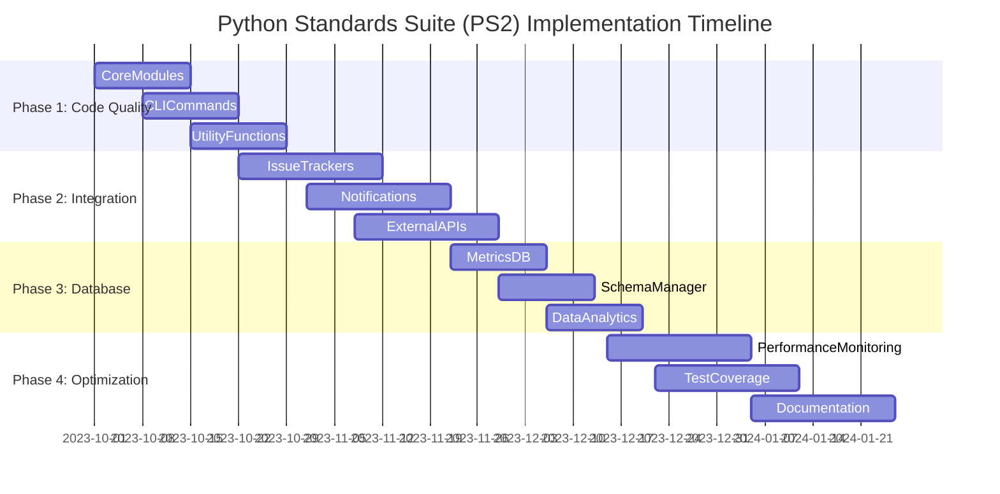

# SYSTEM ARCHITECTURE

## PROPERLY UTILIZING THE RESTRUCTURING PLAN

This file outlines the phased restructuring plan for the Python Standards Suite (PS2) codebase. It provides a systematic approach to addressing architectural issues, with specific tasks organized into phases. When implementing improvements or refactoring the codebase, refer to this document to understand implementation priorities, the sequence of work, and success criteria for each phase. This document serves as the tactical roadmap for transforming the codebase to align with the architecture defined in the System Integration document.

## IMPLEMENTATION APPROACH

When working with this restructuring plan:

1. Analyze each phase to understand its objectives and implementation requirements
2. Prioritize tasks according to the specified sequence within each phase
3. Implement solutions that address the core architectural issues identified in the plan
4. Reference the success metrics to validate that implementations meet the required standards
5. Ensure each implementation contributes to the overall restructuring goals

## PHASE-BASED IMPLEMENTATION

Approach implementation in a structured manner following the phases outlined in the document:

1. For **Foundation and Analysis** tasks, focus on establishing architectural standards and analyzing current implementations
2. During **Core System Implementation**, develop standardized patterns for manager services, UI connections, and game loop integration
3. For **Module-by-Module Integration**, systematically implement connections between components following the specified patterns
4. When addressing **Performance Optimization and QA**, focus on measuring against the success metrics and implementing optimizations

## RELATIONSHIP TO SYSTEM INTEGRATION

While implementing this restructuring plan,  maintain consistency with the architectural specifications in the System Integration document by:

1. Ensuring all new implementations align with the component relationships defined in the integration map
2. Addressing the critical issues and missing connections identified in the integration document
3. Implementing the standardized patterns that fulfill both the restructuring goals and architectural requirements
4. Validating that completed work satisfies both the architectural vision and the restructuring success criteria

```json
{
  "project": "Python Standards Suite (PS2)",
  "current_issues": [
    "Code quality inconsistencies",
    "Linting issues and code smells",
    "Cognitive complexity in core modules",
    "Incomplete integration with external services"
  ],
  "goal": "Transform codebase into a maintainable, scalable system with consistent code quality standards and comprehensive integration capabilities"
}
```

## Reference Documents

```json
{
  "reference_architecture": [
    "System Integration Map",
    "System Architecture Diagrams"
  ],
  "priority": "Implement connections depicted in diagrams while standardizing patterns"
}
```

## Implementation Timeline

```json
{
  "phases": [
    {
      "id": "phase1",
      "name": "Code Quality Improvement",
      "duration": "2 weeks",
      "components": ["CoreModules", "CLICommands", "UtilityFunctions"]
    },
    {
      "id": "phase2",
      "name": "Integration Enhancement",
      "duration": "3 weeks",
      "components": ["IssueTrackers", "Notifications", "ExternalAPIs"]
    },
    {
      "id": "phase3",
      "name": "Database and Metrics",
      "duration": "2 weeks",
      "components": ["MetricsDB", "SchemaManager", "DataAnalytics"]
    },
    {
      "id": "phase4",
      "name": "Performance Optimization and Testing",
      "duration": "3 weeks",
      "components": ["PerformanceMonitoring", "TestCoverage", "Documentation"]
    }
  ]
}
```

## Phase 1: Code Quality Improvement

### Component: CoreModules
**Implementation ID**: `phase1.core`

#### Analysis Tasks
- Analyze code quality in core modules (analyzer.py, code_quality.py, etc.)
- Identify linting issues, code smells, and cognitive complexity problems
- Map dependencies between core modules and identify potential refactoring opportunities
- Generate report on code quality compliance

#### Implementation Tasks
```typescript
interface CoreModulesTasks {
  linting_standardization: {
    target_files: string[]; // List of core module files
    linting_rules: {
      unused_imports: string; // Rules for unused imports
      cognitive_complexity: string; // Rules for cognitive complexity
      code_style: string; // Rules for code style (line length, whitespace, etc.)
    }
  };
  refactoring: {
    complex_functions: [
      {file: string, function: string, complexity: number}
    ];
    implementation_priority: number[]; // Refactoring implementation order
  };
  testing: {
    test_coverage: string[]; // Areas needing improved test coverage
    test_cases: string[]; // New test cases to implement
    validation_approach: string; // Approach for validating refactored code
  }
}
```

### Component: CLICommands
**Implementation ID**: `phase1.cli`

#### Analysis Tasks
- Review CLI command implementation patterns across all command modules
- Identify inconsistencies in argument parsing and error handling
- Analyze code duplication in command implementations
- Map dependencies between commands and core services

#### Implementation Tasks
```typescript
interface CLICommandsTasks {
  standardization: {
    command_pattern: string; // Standard command implementation pattern
    argument_parsing: string; // Consistent approach to argument parsing
    error_handling: string; // Standardized error handling
  };
  refactoring: {
    duplicated_code: [
      {files: string[], code_pattern: string, solution: string}
    ];
    implementation_priority: string[]; // Refactoring priority order
  };
  testing: {
    command_test_cases: string[]; // Test cases for CLI commands
    integration_tests: string[]; // Integration tests for command workflows
  }
}
```

### Component: UtilityFunctions
**Implementation ID**: `phase1.utils`

#### Analysis Tasks
- Review utility functions across the codebase (file_operations.py, logging_utils.py, metrics.py)
- Identify inconsistencies in error handling and logging
- Analyze code reuse patterns and potential for consolidation
- Map utility function usage across the codebase

#### Implementation Tasks
```typescript
interface UtilityStandardizationTasks {
  error_handling: {
    error_pattern: string; // Standard error handling pattern
    exception_hierarchy: string; // Exception class hierarchy
    logging_integration: string; // Integration with logging system
  };
  refactoring: {
    common_utilities: string[]; // Utilities that could be consolidated
    implementation_steps: string[]; // Steps for refactoring utilities
  };
  documentation: {
    docstring_format: string; // Standard docstring format
    usage_examples: string[]; // Examples of utility function usage
    api_documentation: string; // API documentation approach
  }
}
```

## Phase 2: Integration Enhancement

### Component: IssueTrackers
**Implementation ID**: `phase2.issues`

#### Analysis Tasks
- Review issue tracker integration implementations (GitHub, Jira)
- Identify common patterns and potential for abstraction
- Analyze error handling and retry mechanisms
- Document authentication and API usage patterns

#### Implementation Tasks
```typescript
interface IssueTrackerTasks {
  interface_definition: {
    base_tracker_interface: string; // Standard issue tracker interface
    adapter_pattern: Record<string, string>; // Adapter implementations
  };
  authentication: {
    credential_management: string; // Secure credential handling
    token_refresh: string; // Token refresh mechanisms
  };
  implementation: {
    api_implementations: [
      {provider: string, endpoints: string[], implementation: string}
    ];
    error_handling: string; // Error handling and retry mechanisms
  };
  testing: {
    mock_services: string; // Mock services for testing
    integration_tests: string[]; // Integration test scenarios
  }
}
```

### Component: Notifications
**Implementation ID**: `phase2.notify`

#### Analysis Tasks
- Review notification service implementations (email, system notifications)
- Identify notification delivery patterns and failure handling
- Analyze template rendering and personalization capabilities
- Document integration with other system components

#### Implementation Tasks
```typescript
interface NotificationTasks {
  interface_definition: {
    notification_interface: string; // Standard notification interface
    provider_adapters: Record<string, string>; // Provider-specific adapters
  };
  templating: {
    template_engine: string; // Template rendering approach
    personalization: string; // Personalization capabilities
  };
  delivery: {
    delivery_strategies: string[]; // Notification delivery strategies
    retry_mechanism: string; // Retry mechanism for failed deliveries
    queueing_system: string; // Queueing system for notifications
  };
  integration: {
    event_triggers: string[]; // Events that trigger notifications
    user_preferences: string; // User notification preferences
  }
}
```

### Component: ExternalAPIs
**Implementation ID**: `phase2.apis`

#### Analysis Tasks
- Review external API integration patterns across the codebase
- Identify authentication mechanisms and token management
- Analyze rate limiting and throttling implementations
- Document error handling and retry strategies

#### Implementation Tasks
```typescript
interface ExternalAPITasks {
  standardization: {
    client_interface: string; // Standard API client interface
    request_handling: string; // Request handling pattern
    response_parsing: string; // Response parsing approach
  };
  security: {
    authentication: string; // Authentication mechanisms
    token_management: string; // Token management and refresh
    secret_handling: string; // Secure handling of API secrets
  };
  resilience: {
    rate_limiting: string; // Rate limiting implementation
    circuit_breaker: string; // Circuit breaker pattern
    retry_strategy: string; // Retry strategy for failed requests
  };
  monitoring: {
    logging: string; // API call logging
    metrics: string; // API call metrics collection
    alerting: string; // Alerting for API issues
  }
}
```
  initialization: {
    sequence_implementation: string; // Initialization sequence implementation
    dependency_graph: Record<string, string[]>; // Manager dependencies
  }
}
```

### Component: UIConnections
**Implementation ID**: `phase2.ui`

#### Analysis Tasks
- Catalog UI component context usage
- Identify event subscription patterns
- Map action dispatch patterns
- Analyze data flow from backend to UI

#### Implementation Tasks
```typescript
interface UIConnectionTasks {
  context_usage: {
    standardized_hooks: Record<string, string>; // Custom hooks for contexts
    implementation_priority: string[]; // Hook implementation order
  };
  event_subscriptions: {
    standard_pattern: string; // Standard subscription pattern
    implementation_examples: Record<string, string>; // Example implementations
  };
  component_updates: {
    priority_components: string[]; // Components to update first
    implementation_steps: Record<string, string[]>; // Steps for each component
  }
}
```

### Component: GameLoop
**Implementation ID**: `phase2.gameloop`

#### Analysis Tasks
- Identify current update mechanisms
- Map system update dependencies
- Analyze performance characteristics
- Document timing requirements

#### Implementation Tasks
```typescript
interface GameLoopTasks {
  central_implementation: {
    loop_manager: string; // Game loop manager implementation
    update_scheduling: string; // Update scheduling mechanism
  };
  system_integration: {
    priority_systems: string[]; // Systems to integrate first
    integration_pattern: Record<string, string>; // Pattern for each system
  };
  performance: {
    optimization_strategies: string[]; // Performance optimization strategies
    monitoring_implementation: string; // Performance monitoring implementation
  }
}
```

## Phase 3: Module-by-Module Integration

### Component: ResourceModule
**Implementation ID**: `phase3.resources`

#### Analysis Tasks
- Map resource UI components to ResourceFlowManager
- Identify resource visualization update patterns
- Analyze threshold and alert connections
- Document resource-related user interactions

#### Implementation Tasks
```typescript
interface ResourceModuleIntegrationTasks {
  ui_refactoring: {
    component_list: string[]; // Resource UI components
    hook_implementations: Record<string, string>; // Hooks for components
  };
  event_subscriptions: {
    subscription_implementations: Record<string, string>; // Event subscriptions
  };
  testing: {
    integration_tests: string[]; // Integration test specifications
    test_implementation: Record<string, string>; // Test implementations
  };
  documentation: {
    pattern_documentation: string; // Documentation of resource patterns
    developer_guides: string[]; // Developer guide topics
  }
}
```

### Component: ModuleSystem
**Implementation ID**: `phase3.modules`

#### Implementation Tasks
```typescript
interface ModuleSystemIntegrationTasks {
  ui_refactoring: {
    component_list: string[]; // Module UI components
    hook_implementations: Record<string, string>; // Hooks for components
  };
  event_subscriptions: {
    subscription_implementations: Record<string, string>; // Event subscriptions
  };
  testing: {
    integration_tests: string[]; // Integration test specifications
    test_implementation: Record<string, string>; // Test implementations
  };
  documentation: {
    pattern_documentation: string; // Documentation of module patterns
    developer_guides: string[]; // Developer guide topics
  }
}
```

## Phase 3: Database and Metrics

### Component: MetricsDB
**Implementation ID**: `phase3.metrics`

#### Analysis Tasks
- Review metrics collection and storage implementations
- Identify data schema and indexing strategies
- Analyze query patterns and performance bottlenecks
- Document integration with reporting and visualization tools

#### Implementation Tasks
```typescript
interface MetricsDBTasks {
  schema_design: {
    data_models: Record<string, string>; // Data models for metrics
    indexing_strategy: string; // Indexing strategy for performance
    partitioning: string; // Data partitioning approach
  };
  collection: {
    collection_points: string[]; // Points in the code where metrics are collected
    aggregation_logic: string; // Logic for aggregating metrics
    buffering_strategy: string; // Strategy for buffering metrics before storage
  };
  querying: {
    query_interfaces: string; // Interfaces for querying metrics
    optimization: string; // Query optimization techniques
    caching: string; // Caching strategy for frequent queries
  };
  visualization: {
    reporting_api: string; // API for generating reports
    dashboard_integration: string; // Integration with dashboards
    export_capabilities: string; // Data export capabilities
  }
}
```

### Component: SchemaManager
**Implementation ID**: `phase3.schema`

#### Analysis Tasks
- Review schema management and migration implementations
- Identify schema versioning and compatibility strategies
- Analyze migration testing and validation approaches
- Document integration with database systems

#### Implementation Tasks
```typescript
interface SchemaManagerTasks {
  versioning: {
    schema_versioning: string; // Schema versioning approach
    compatibility_checking: string; // Compatibility checking between versions
    version_tracking: string; // Tracking schema versions in the database
  };
  migrations: {
    migration_generation: string; // Generation of migration scripts
    migration_execution: string; // Execution of migrations
    rollback_strategy: string; // Strategy for rolling back failed migrations
  };
  testing: {
    migration_testing: string; // Testing migrations before deployment
    data_validation: string; // Validating data integrity after migrations
    performance_testing: string; // Testing performance impact of migrations
  };
  integration: {
    database_adapters: Record<string, string>; // Adapters for different database systems
    deployment_integration: string; // Integration with deployment processes
    monitoring: string; // Monitoring migration execution
  }
}
```

### Component: DataAnalytics
**Implementation ID**: `phase3.analytics`

#### Analysis Tasks
- Review data analytics and reporting implementations
- Identify data processing and transformation patterns
- Analyze reporting formats and delivery mechanisms
- Document integration with visualization tools

#### Implementation Tasks
```typescript
interface DataAnalyticsTasks {
  processing: {
    data_extraction: string; // Extracting data from various sources
    transformation_logic: string; // Logic for transforming data
    loading_strategy: string; // Strategy for loading processed data
  };
  analysis: {
    statistical_methods: string[]; // Statistical methods for analysis
    trend_detection: string; // Detecting trends in data
    anomaly_detection: string; // Detecting anomalies in data
  };
  reporting: {
    report_templates: Record<string, string>; // Templates for different reports
    scheduling: string; // Scheduling report generation
    delivery_mechanisms: string[]; // Mechanisms for delivering reports
  };
  visualization: {
    chart_generation: string; // Generating charts and graphs
    interactive_dashboards: string; // Creating interactive dashboards
    export_formats: string[]; // Formats for exporting visualizations
  }
}
```
  }
}
```

### Component: ExplorationSystem
**Implementation ID**: `phase3.exploration`

#### Implementation Tasks
```typescript
interface ExplorationSystemIntegrationTasks {
  ui_refactoring: {
    component_list: string[]; // Exploration UI components
    hook_implementations: Record<string, string>; // Hooks for components
  };
  event_subscriptions: {
    subscription_implementations: Record<string, string>; // Event subscriptions
  };
  testing: {
    integration_tests: string[]; // Integration test specifications
    test_implementation: Record<string, string>; // Test implementations
  };
  documentation: {
    pattern_documentation: string; // Documentation of exploration patterns
    developer_guides: string[]; // Developer guide topics
  }
}
```

## Phase 4: Performance Optimization and QA

### Component: PerformanceOptimization
**Implementation ID**: `phase4.performance`

#### Implementation Tasks
```typescript
interface PerformanceOptimizationTasks {
  monitoring: {
    critical_systems: string[]; // Systems to monitor
    monitoring_implementation: string; // Monitoring implementation
  };
  profiling: {
    key_operations: string[]; // Operations to profile
    profiling_implementation: string; // Profiling implementation
  };
  optimization: {
    target_areas: Record<string, string>; // Areas to optimize
    implementation_strategies: Record<string, string>; // Optimization strategies
  };
  benchmarks: {
    benchmark_implementations: Record<string, string>; // Benchmark implementations
    success_criteria: Record<string, number>; // Success criteria
  }
}
```

### Component: TestingQA
**Implementation ID**: `phase4.testing`

#### Implementation Tasks
```typescript
interface TestingQATasks {
  coverage: {
    core_systems: Record<string, number>; // Target coverage for core systems
    implementation_strategy: string; // Coverage implementation strategy
  };
  integration_tests: {
    boundary_tests: Record<string, string>; // Tests for system boundaries
    implementation_priority: string[]; // Test implementation order
  };
  simulation_tests: {
    complex_systems: string[]; // Systems for simulation testing
    implementation_approach: string; // Simulation test approach
  };
  automation: {
    quality_checks: string[]; // Automated quality checks
    integration_approach: string; // Integration with development workflow
  }
}
```

## Implementation Tools

### Cursor AI Capabilities Utilization
```json
{
  "analysis_capabilities": [
    {
      "capability": "Pattern Detection",
      "utilization": "Identify inconsistent patterns across the codebase"
    },
    {
      "capability": "Type Analysis",
      "utilization": "Analyze type usage and suggest standardized types"
    },
    {
      "capability": "Code Complexity Analysis",
      "utilization": "Identify complex functions for refactoring"
    }
  ]
}
```

## SUCCESS CRITERIA

### Phase 1: Code Quality Improvement
- All identified linting issues resolved across core modules
- Cognitive complexity reduced in complex functions
- Consistent error handling and logging implemented
- CLI commands standardized with consistent argument parsing
- Utility functions consolidated and well-documented

### Phase 2: Integration Enhancement
- Common interface implemented for all issue tracker integrations
- Secure credential management for external services
- Standardized notification system with multiple delivery channels
- Robust external API clients with proper error handling and retry mechanisms
- Comprehensive logging and monitoring for all external integrations

### Phase 3: Database and Metrics
- Efficient metrics collection and storage system
- Robust schema management with versioning and migration capabilities
- Comprehensive data analytics and reporting capabilities
- Performance-optimized database queries
- Data visualization integrated with reporting systems

### Phase 4: Performance Optimization and Testing
- Performance monitoring implemented across critical code paths
- Test coverage increased to target levels across the codebase
- Comprehensive documentation updated for all components
- CI/CD integration for automated testing and deployment
- Performance benchmarks established and regularly monitored

## IMPLEMENTATION TIMELINE



## RISK ASSESSMENT

| Risk | Impact | Likelihood | Mitigation |
|------|--------|------------|------------|
| Cognitive complexity reduction introduces new bugs | High | Medium | Comprehensive test coverage before and after refactoring |
| Integration with external services fails | High | Medium | Robust error handling, fallback mechanisms, and thorough testing |
| Performance degradation during refactoring | Medium | Low | Performance benchmarking before and after changes |
| Documentation becomes outdated | Medium | High | Automated documentation checks and regular reviews |
| Test coverage remains insufficient | High | Medium | Incremental approach with coverage targets for each phase |

## CONCLUSION

This restructuring plan provides a systematic approach to improving the Python Standards Suite (PS2) codebase. By following the phased implementation approach, we can address the most critical issues first while building a foundation for future enhancements. The success criteria for each phase provide clear targets to measure progress, and the risk assessment helps identify potential challenges and mitigation strategies.

As the implementation progresses, this document should be updated to reflect changes in priorities, timelines, and implementation details. Regular reviews of progress against the success criteria will help ensure that the restructuring effort remains on track and delivers the expected benefits.
    {
      "capability": "Type Analysis",
      "utilization": "Analyze type usage and suggest standardized types"
    },
    {
      "capability": "Dependency Mapping",
      "utilization": "Map dependencies between components and systems"
    }
  ],
  "generation_capabilities": [
    {
      "capability": "Code Generation",
      "utilization": "Generate standardized implementations for core components"
    },
    {
      "capability": "Refactoring Scripts",
      "utilization": "Create scripts for transforming existing code"
    },
    {
      "capability": "Test Generation",
      "utilization": "Generate test cases for system connections"
    }
  ],
  "verification_capabilities": [
    {
      "capability": "Architecture Validation",
      "utilization": "Verify implementations against architecture specifications"
    },
    {
      "capability": "Type Checking",
      "utilization": "Ensure consistent type usage across the codebase"
    },
    {
      "capability": "Performance Analysis",
      "utilization": "Identify potential performance issues"
    }
  ]
}
```

## Success Metrics and Verification

```json
{
  "type_safety": {
    "metrics": [
      {
        "name": "TypeScript Error Reduction",
        "target": "90% reduction in TypeScript errors",
        "measurement": "Compiler error count before vs. after"
      },
      {
        "name": "Any Type Reduction",
        "target": "95% reduction in 'any' type usage",
        "measurement": "Count of 'any' types before vs. after"
      }
    ]
  },
  "component_connections": {
    "metrics": [
      {
        "name": "UI-Backend Connection",
        "target": "100% of UI components properly connected",
        "measurement": "Static analysis of component-context connections"
      },
      {
        "name": "State Update Reliability",
        "target": "Zero stale state issues",
        "measurement": "Automated tests for state propagation"
      }
    ]
  },
  "code_quality": {
    "metrics": [
      {
        "name": "Test Coverage",
        "target": "85% test coverage for critical systems",
        "measurement": "Test coverage reports"
      },
      {
        "name": "Pattern Consistency",
        "target": "95% adherence to standardized patterns",
        "measurement": "Static analysis of pattern usage"
      }
    ]
  },
  "performance": {
    "metrics": [
      {
        "name": "Rendering Performance",
        "target": "60 FPS for complex UI components",
        "measurement": "Performance profiling"
      },
      {
        "name": "Resource Flow Optimization",
        "target": "50% reduction in computation time",
        "measurement": "Benchmark comparisons"
      }
    ]
  }
}
```

## Implementation Notes for AI

1. This plan is structured for machine parsing and execution. Each component has a unique implementation ID for reference.

2. Implementation priorities are explicitly specified to guide execution order.

3. Type definitions and interfaces are provided as templates for code generation.

4. Success metrics are quantifiable and measurable through automated means.

5. The plan assumes an iterative implementation approach with continuous validation against architecture specifications.

## AI-Specific Instructions

1. Parse each component section to extract implementation tasks.

2. Generate comprehensive analysis reports before beginning implementation.

3. Create standardized patterns based on the specifications in each component section.

4. Prioritize implementation based on the specified order and dependencies.

5. Validate each implementation against the success metrics before proceeding to the next component.

6. Generate documentation for implemented patterns and components to ensure knowledge transfer.

7. Utilize the specified AI capabilities for analysis, generation, and verification throughout the implementation process.